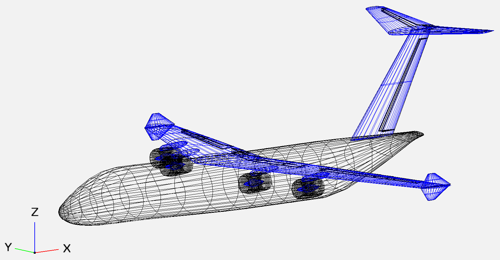
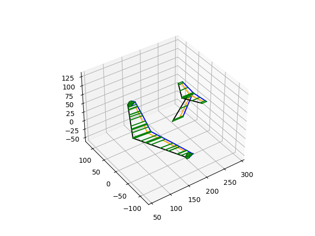
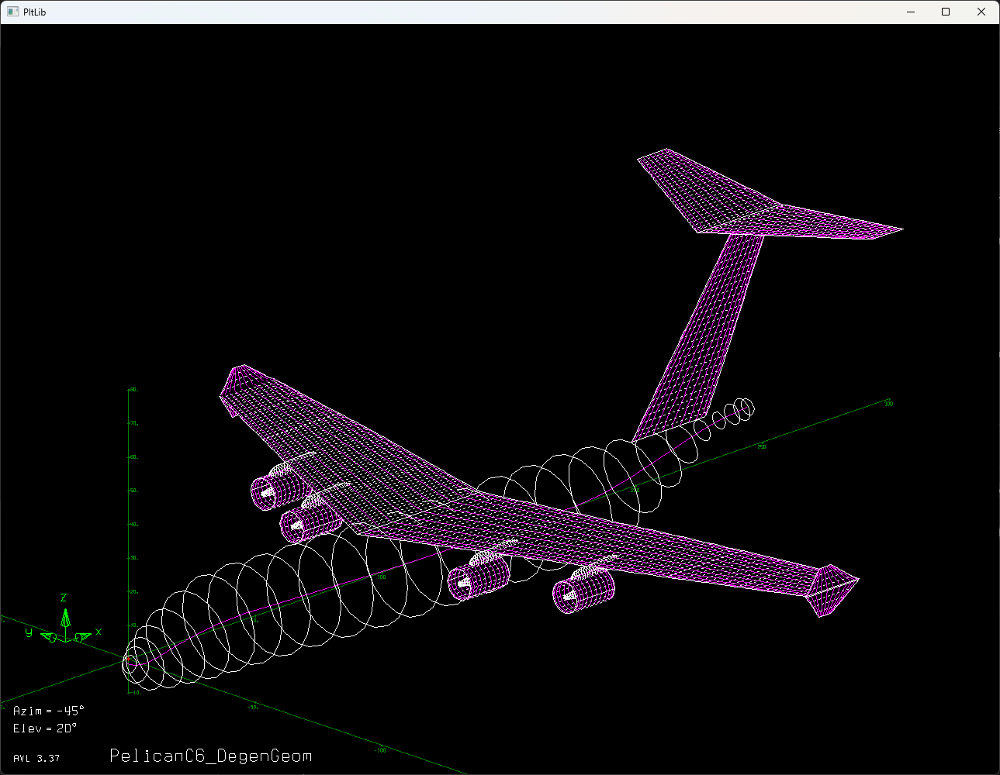
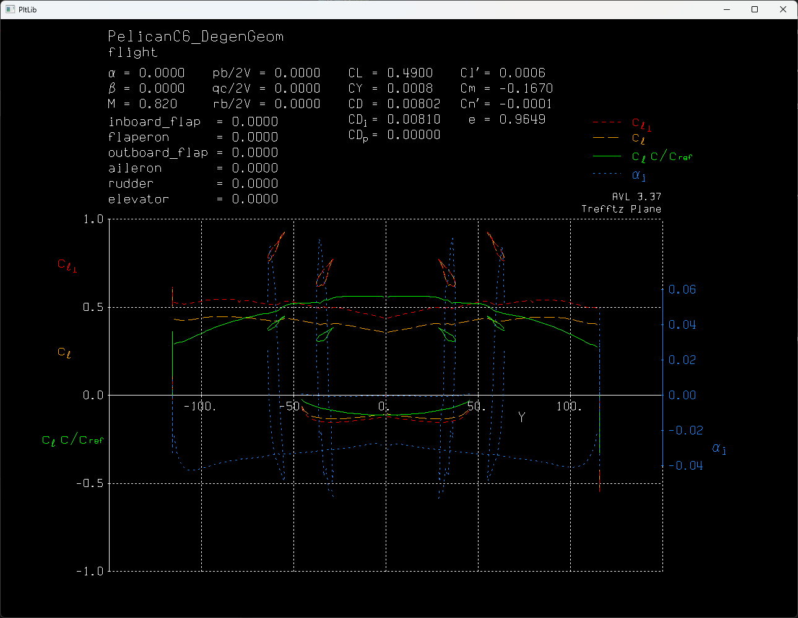

# VSP2AVL
Create AVL geometry files using OpenVSP's DegenGeom export files

## Introduction
VSP2AVL is intended to provide a fast way to convert OpenVSP (Open Vehicle Sketch Pad) aircraft geometry into an AVL (Athena Vortex Lattice) file compatible with AVL aerodynamic analysis. This allows for rapid iteration on aircraft design using OpenVSP and AVL together.

In its current state, VSP2AVL can convert basic lifting and control surfaces into AVL geometry format. VSP2AVL *cannot* accurately convert objects which have been rotated about the z-axis due to leading edge-trailing edge misalignment on the XZ plane.

VSP2AVL has limited capability to convert bodies into AVL, and—at the moment—it can only convert them into AVL *bodies*, not cruciform lifting surfaces, which is the recommended method.

VSP2AVL has been tested on Python 3.11.5 and NumPy 1.24.3 on a Windows machine.

### Disclaimer:
VSP2AVL is **not guaranteed by any means** to provide an accurate output, so it is always recommended to check the .avl output to ensure it gives the desired translation.

## Sample Images

OpenVSP aircraft geometry

Debug geometry plot generated by VSP2AVL

Resultant AVL geometry plot

Sample Trefftz plot

## Usage
1. With a .vsp3 file open in OpenVSP, export the model geometry using `Analysis > DegenGeom > .csv > Execute`. 

2. Export airfoil geometry data into the same folder as the `.csv` using `File > Export > Airfoil Points (.dat) > OK`. This airfoil coordinate data will be modified and pointed to in the `.avl` file.

3. In Command Prompt or Powershell, run `python VSP2AVL.py` in order to create the `config.ini` configuration file.

4. Add relevant AVL reference information to `config.ini`: 

    1. Set reference wing to desired wing number (these numbers can be found as an enumeration of all components discovered in the DegenGeom .csv after running VSP2AVL) for automatic estimation of below parameters.

    2. `Sref`, `Cref`, `Bref`, `Xref`, `Yref`, `Zref` and `mach_number`

    3. Specify model geometry tolerance as `tolerance`. Units of tolerance are the same as units in `DegenGeom.csv`.

    4. If it is desired to translate control surfaces into AVL, set `model control surfaces` to `yes`. Note that the control surface translation process creates new wing sections in the output AVL file.

    5. If non- lifting-surface bodies are desired to be converted to AVL, set `model bodies` to `yes`.

    6. Set lifting-surface vortex resolution in with `vortices per unit length`
    .
    7. Easy debugging via output geometry plotting is possible by setting `post processing geometry plot` to `yes`.
  
5. Run `python VSP2AVL.py` in command prompt with argument `filepath`. This will create a new file of name `filename.avl` which can be used with AVL.

Example usage: `python VSP2AVL.py "C:\Users\user\Documents\A320_DegenGeom.csv"`

Add in the `--debug` argument to force `post processing geometry plot`.

## Future Work
* Bug testing

* Implementing cruciform lifting surface body modeling

* Reading airfoil data from DegenGeom instead of requiring airfoil geometry export from VSP
